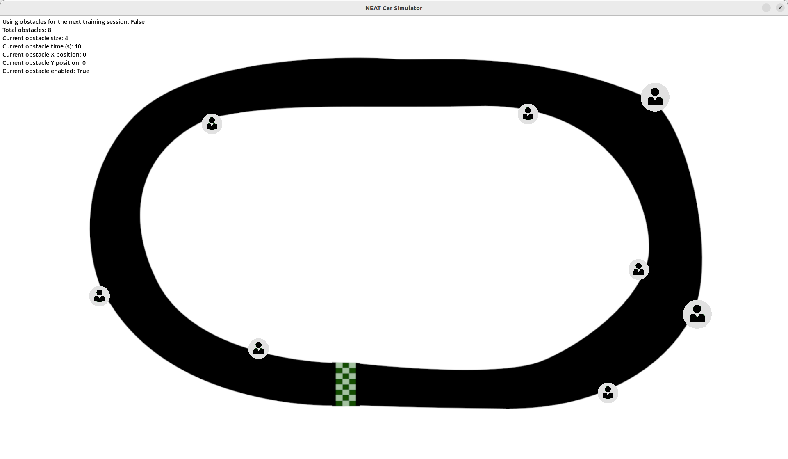
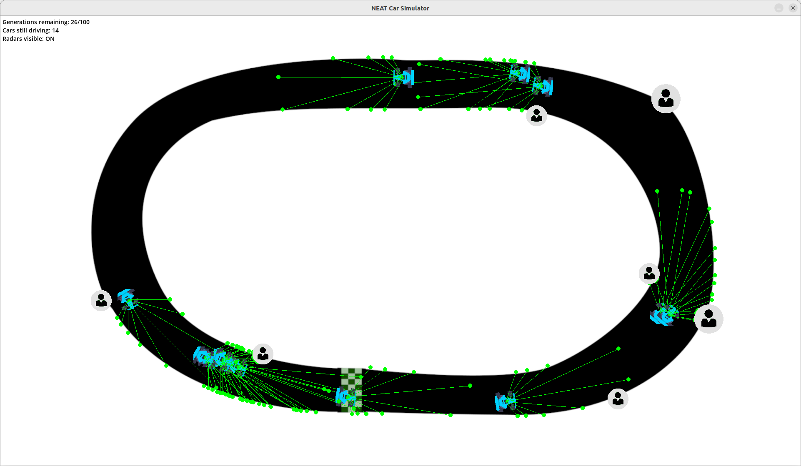

[Home](README.md)

# View angle and number of inputs

The view angle refers to the field of view of the input sensor. Imagine this sensor to be a lidar scanning
the environment 360&deg; every 10&deg;... That would be equal to 36 individual input sensors.

Try not to over do it. It's a simulation that runs on the CPU (remember that NEAT-Python doesn't offer any
GPU-facilitated perfomance boost). I found that the most optimal number of inputs is 9 (perhaps even 11).
One sensor to detect what's in fron of the car and 4 on each size (or 5 in case we are working with 11
inputs). Anything (much) greater than that, and you will soon hear the CPU throtling!

The view angle... certainly doesn't need to be beyond 180&deg;. Of course, if you set it to 180&deg; it will
eventually try to center the car in the middle of the lane but I found setting the view angle at 120&deg; and
the number of inputs at 9 to be the most reasonable setup. That's a sensor every 15&deg; in a XY plane.

# Hidden nodes and number of outputs

As there's nothing the car can do except for turning left or right, slowind down or accelerating, the number
of outputs is clear... 4 of them, where each one is assigned a number: 0-Left, 1-Right, 2-Slow down and 3-Accelerate.

Sof if we have a look at the `config.ini` file where all NEAT-Python related parameters are defined, we end up
with something like this:

```shell
num_hidden = 2
num_inputs = 9
num_outputs = 4
```

I am not sure if changing the number of hidden layers beyond 2 will make any difference for the purposes of
this game. Honestly, you could try setting to a higher value, but I doubt the NN will evolve to something
radically complex for basically steering our sprite left and right, slowing down, speeding up or keeping
a constant pace.

All of the nodes are initially fully connected (`initial_connection = full`) i.e. each input node to each
output node, or if there are any hidden/inner nodes, each input to all inner nodes, and similarly, each
inner to all output nodes.

# Population

The number of individuals in each generation or *population size* is set to 30. What happens when all species
simultaneously become extinct due to stagnation (no evolutionary progress)?

There are two possibilites: 1-a new random population is created so that the simulation may continue and give
the NN topology a chance to evolve (*True*) or 2-a complete species extinction occurs (*False*).

```shell
pop_size = 30
reset_on_extinction = True
```

# Elitism

Elitism or *the number of most-fit individuals in each species that will be preserved as-is from one generation
to the next* is by default 0.

Species elitism or *the number of species that will be protected from stagnation* and *prevent total extinctions
caused by all species becoming stagnant before new species arise*. This one is also 0 by default.

```shell
elitism = 3
species_elitism = 2
```

# Fitness

```shell
fitness_criterion = max
fitness_threshold = 100000000
```

The function used to compute the termination criterion from the set of genome fitnesses is set to `max`. The other
allowed values are: `min` and `mean`.

When the fitness computed by `fitness_criterion` meets or exceeds the threshold specified with `fitness_threshold`,
the evolution process will terminate.

> Note: All of these parameters (and much more) are well documented in [the configuration file description of
NEAT-Python](https://neat-python.readthedocs.io/en/latest/config_file.html).

# A word (or two) on the `reward` and `fitness` functions

If we have a look at the way the `reward` function is defined inside the `car.py` module:

```python
def get_reward(self):
    return self.distance / (int(CAR_SIZES[self.args.car_size] / 2))
```

We see that essentially, the agent is rewarded on the distance the car sprite covers without crashing.

Than if we switch over to the `neural_network.py` module, and search for 'fitness', we could quickly come to
the following assignment statement:

```python
genomes[i][1].fitness += car.get_reward()
```

This means that the `fitness` of each representative of a current generation is increased by the award
received, further cementing the conclusion that the entire setup functions on the principle *cover as much
distance as possible without crashing*!

Just as the `reward` function as in a way normalized to take into an account the size of the selected sprite,
we could as easily update it to take into an account the `speed` of the sprite and change the principle to:

- *cover as much distance as possible, **as quick** as possible - without crashing*, or
- *cover as much distance as possible, **as slow** as possible - without crashing*

# A few observations on performance and learning

What I did was run 2 separate simulations with the simplete of the two tracks (`map01.png`), set the number
of inputs at 9 and the view angle or field of view at 120&deg;.

I have set the number of generations at 100, and chose to create a checkpoint at either every 10 passed
generations or every 120sec - which ever event is reached first.

I also redirected the output from the console to a file:

```shell
python3 main.py --inputs=9 --view_angle=120 > simulation01.txt
```

> Note: The rest of the arguments I have updated from the application menu!

Once the simulation was run, all of the statistics collected during the run were aptly stored in the file!
Hence the redirect.

The application essentially collects statistics from each generation, so if we were to look at the figures
of the absolute first generation and the last one, it would look something like this:

```
****** Running generation 0 ****** 

Population's average fitness: 250.03200 stdev: 353.42260
Best fitness: 1565.12000 - size: (6, 26) - species 15 - id 15
Average adjusted fitness: 0.157
Mean genetic distance 2.882, standard deviation 0.534
Population of 90 members in 30 species:
   ID   age  size  fitness  adj fit  stag
  ====  ===  ====  =======  =======  ====
     1    0     3    166.4    0.103     0
     2    0     3     22.0    0.010     0
     3    0     3      6.0    0.000     0
     4    0     3      6.0    0.000     0
     5    0     3    190.4    0.118     0
     6    0     3      8.5    0.002     0
     7    0     3    684.4    0.435     0
     8    0     3     18.0    0.008     0
     9    0     3    190.4    0.118     0
    10    0     3     15.7    0.006     0
    11    0     3     18.0    0.008     0
    12    0     3    684.4    0.435     0
    13    0     3    190.4    0.118     0
    14    0     3     11.2    0.003     0
    15    0     3   1565.1    1.000     0
    16    0     3    684.4    0.435     0
    17    0     3    684.4    0.435     0
    18    0     3    101.2    0.061     0
    19    0     3     11.2    0.003     0
    20    0     3     31.2    0.016     0
    21    0     3    361.2    0.228     0
    22    0     3     22.0    0.010     0
    23    0     3    684.4    0.435     0
    24    0     3     22.0    0.010     0
    25    0     3    684.4    0.435     0
    26    0     3    212.4    0.132     0
    27    0     3     14.5    0.005     0
    28    0     3    190.4    0.118     0
    29    0     3      6.0    0.000     0
    30    0     3     14.4    0.005     0
Total extinctions: 0
Generation time: 1.640 sec

****** Running generation 99 ****** 

Population's average fitness: 245283.24800 stdev: 435214.73243
Best fitness: 1567892.88000 - size: (9, 28) - species 20 - id 1086
Average adjusted fitness: 0.153
Mean genetic distance 1.376, standard deviation 0.607
Population of 30 members in 2 species:
   ID   age  size  fitness  adj fit  stag
  ====  ===  ====  =======  =======  ====
    20   99    18  1567892.9  0.179    38
    31   62    12  863363.5   0.126    25
Total extinctions: 0
Generation time: 23.629 sec (27.855 average)
```
We may draw many conclusions from this output alone, but the most important one for this simple run,
is the one related to the `fitness` itself:

- We can observe that the system definetely learns on its own
- It learns and evolves much quicker at the very begining (first 10 to 20 generations) and then starts slowing down
- To the point that it stops showing any significant progress (evolution!) as of the 61st generation
    - The `average fitness` and therefore the `fitness standard deviation` vary
    - But the `best fitness` remains practically unchanged for the remainder of the training
    - Further more, it's far less than the `threshold` in the `config.ini` file
- In other words, we may run the simulation for 1000 generations but it would be pointless!

This is the reason for the second experiment - run the same simulation but throw in some randomness in
the form of obstacles around the 'sharper' corners of the track:





- The agent learns and evolves quicker at the beginning
- Definetely starts slowing down approximately after the first 1/4 of the run
- But because of the introduced randomness, it doesn't settle down
- It keeps adjusting
    - Meaning, the NN topolgy will not significantly evolve beyond the inner, outter and an inner layer
        - With 2-3 inner nodes (but you're welcome to try)
    - The exiting node weights will keep adjusting and updating
- In theory, we can keep doing this longer than 100 generations (with more obstacles) and expect the system will
  be capable of indefinetely doing a test run with a completely different obstacle setup - without crashing once!! 

I encourage you to try something similar with the second track (ma02.png) or try your own tracks while
using the existings ones as a reference (1920px by 1080px, keeping the start of the track relatively fixed)
and see what conclusions you may draw.

# Feature explorations

If I could start over with this project, to be blunt... I would never do it in this manner. Instead, I would go
with something like [Trackmania](https://www.ubisoft.com/en-us/game/trackmania/trackmania). That way, I don't have to
worry about any game loop, any physics engine, etc. and concentrate on purely the AI specific part.

Some interesting projects around `Trackmania`:

- [Training an unbeatable AI in Trackmania](https://www.youtube.com/watch?v=Dw3BZ6O_8LY)
- [AI exploits a gamebreaking bug in Trackmania](https://m.youtube.com/watch?v=NUl6QikjR04)
- [A.I. learns to drive on a pipe](https://www.youtube.com/watch?v=iZIPowqm-fo&t=390s)

[Home](README.md)
