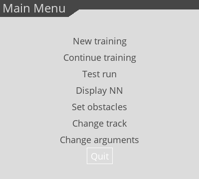
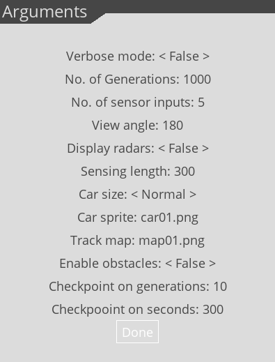
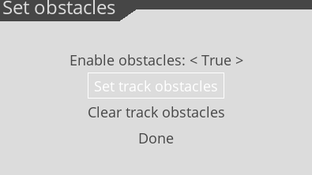
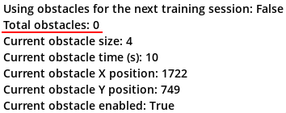
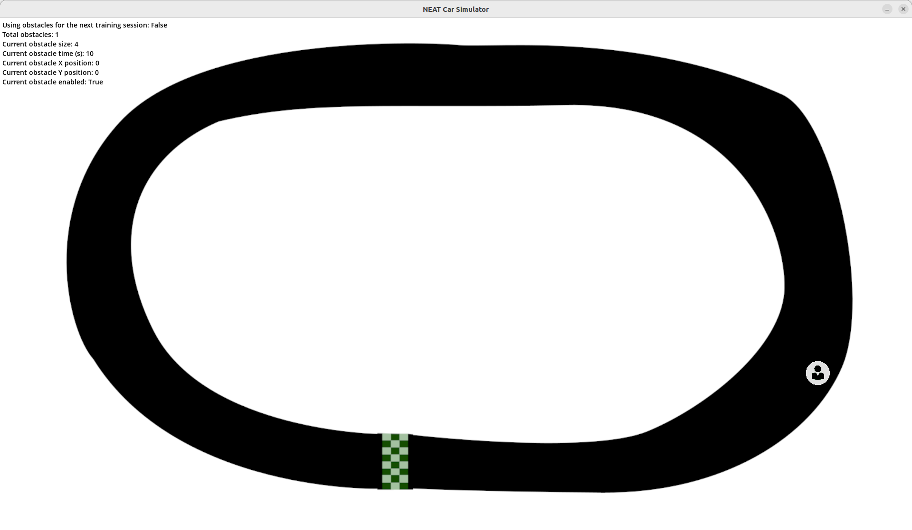
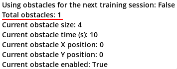
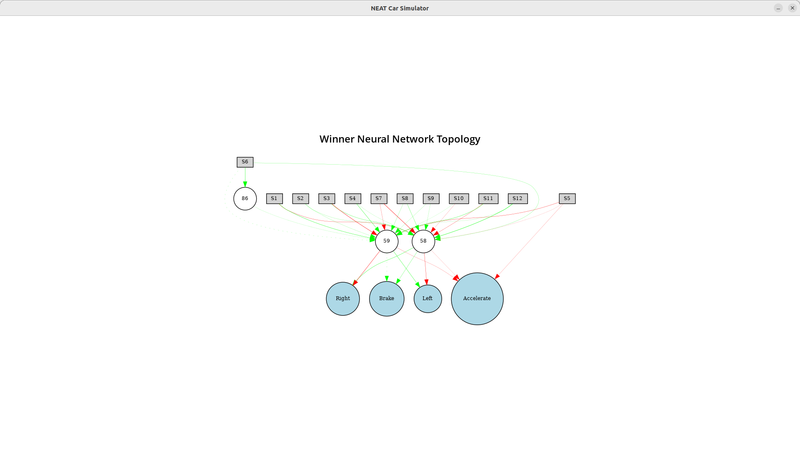

[Home](README.md)

# Command line arguments

The application accepts a few command line arguments (with pre-defined defaults!) which
directly affect the behavior. To see a list of the accepted arguments, you could type:

```shell
python3 main.py --help
```
The accepted command line arguments (in their long form) are:

  - `--help` (display a help message)
  - `--verbose` (activate verbose mode and generates more output)
  - `--generations` (set the number of generations used during the training)
  - `--inputs` (set the number of inputs or effectively the number of sensors the simulated car will be using)
  - `--view_angle` (set the field of view of the radar)
  - `--display_radars` (activate displaying the radars while runnign the simulation)
  - `--sensing_length` (set the radar sensing length i.e. how far each sensor sees in front)
  - `--car_size` (set the size of the car sprite)
  - `--car_sprite` (specify the car sprite itself)
  - `--track_map` (specify the circuit or the track the car will navigate)
  - `--generation_interval` (the number of elapsed generations after which a training checkpoint is generated)
  - `--time_interval_seconds` (the elapsed time in seconds after which a training checkpoint is generated)
  - `--obstacle_sprite` (specify the obstacle sprite)
  - `--enable_obstacles` (enable the use of random obstacle generation)

# Menu system

Accessing the functionalities from the menu system is straightforward and self-explanatory, hence
I won't go into too much detail in explaining everything, except a few things which might not be
apparent.

## Main menu



Whether launching a new training session, continuing with a previous one or simply starting a test run,
you can dynamically toggle displaying the radars by pressing the `R key` on the keyboard.

## Arguments menu

All of the command line arguments are accessible and changeable through this menu:  



## Obstacles menu

In order to dynamically alter the dynamic properties of the selected track, I've added the functionality
of adding obstacles to the track, which randomly appear/disappear within a specified time limit:  



> Note: Obstacles are disabled by default!

> Note: If you change the track, you have to clear and re-set the obstacles manually!

> Note: Anything else required some sort of a tracks management sub-system for which I simply had little time to do.

Once you start setting the obstalces, you basically use the mouse to determine the obstacle position. For the moment,
you can't pick-up an obstacles and drag it accross the track. Keep clicking with your mouse where you want to position
it and press the `N key` on your keyboard to permanently place it.

Placing an obstacle...  
  


Pressing the `left/right arrow keys` will alter the size of the obstacle (from a pre-defined set of sizes), whereas
pressing the `up/down arrow keys` will increase/decrease the timeout for which the obstacle is displayed on the track.
Finally, pressing the `S key` will enable/disable a single individual obstacle during setting up.

Once you're happy with an obstacle, confirm it by pressing the `N key` which will subsequently give the option to add
another obstacle. Keep repeating this until you're happy with the layout and setup of the track.

The number of set obstacles before the first one is added...  
  


An obstacle position and properties has been confirmed...  
  


The number of set obstacles increasing once one is added...  
  


# Gameplay tactics and suggestions

The way I have run the application was:

- Run the training with the most basic trac circuit i.e. `map01.png`
- No less than 5 inputs, but totally unneccessary more than 12
- Viewing angle (or *field of view*) set at 180 degrees (less is also OK but also dependant on the number of sensor inputs)
- No obstacles at first
- Zero hidden layers
- You will notice that even with a small number of generations, the agent quickly learns how to navigate the circuit
- View the NN topologu
- Make a test run
- Change the track e.g. slightly more complex one (`map02.png` will do)
- Carefully decide where to put obstacles
- If the size of the car and obstacle sprite are comparable, placing the obstacle in the dead center of a straight section
  so that the car can't find a way to steer out, will only make result in one thing: the car hitting the obstacle each time!
- Perhaps increase the view angle, the number of sensor inputs
- Definetely increase the number of generations
- Start with about 100 and see how the model performs
- Have a look at the NN topology
- Increase if needed
- You might want to consider adding at least 2 hidden nodes/layers
- Clear the obstacle setup and set a different one (but not extremelly different - remind yourself with the general guideline
  from above as to why; this is a simple project afterall...)
- Make a test run with the new obstacle layout and see if/where the model needs adjustments
- Start a new training session
- and so on...

# An example of a simple NN topology

Not the most elaborate or sophisticated NN - a result from a very narrow and simple training run...  
  


`S1..S12` represent the input sensor nodes, whereas `Left`, `Right`, `Brake` and `Accelerate` are
the output nodes. Everything else represent the inner nodes and within them, the calculated weights
according to the setup of the NEAT-Python algorithm.
